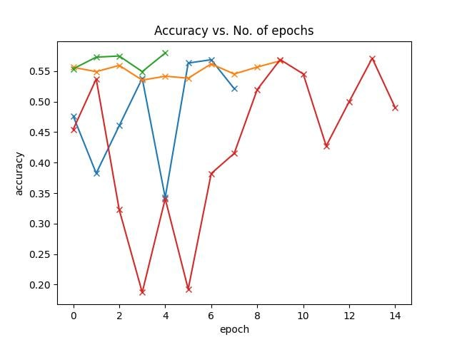

# Обучение нейронных сетей классификации тепловизионных снимков на основе изображений видимого спектра

## Предпосылки исследования
Датасеты для обучения моделей классификации объектов на тепловизионных снимах очень малочислены по количеству и размерам, по сравнению с датасетами изображений видимого спектра.
В случае если можно обучать нейронные сети на агументированных изображениях видимого спектра, то проблема малого количества данных перестает существовать.  
Модели для работы с тепловизионными снимками требуется  в различных областях, начиная от инфракрасных камер безопасности, заканчивая промышленными камерами на производствах.

<h2>Цель исследования</h2>

Целью исследования является разработка метода обучения нейронных
сетей с помощью имитации тепловизионных снимков на основе изображений
видимого спектра. Для достижения цели были выполнены следующие задачи:

1. Исследованы существующие базы данных со снимками видимого
спектра и снимками инфракрасного спектра;
2. Рассмотрены методы обучения нейронных сетей на наборах
данных с тепловизионными снимками;
3. Разработан и реализован метод имитации тепловизионных
снимков для обучения нейронных сетей в задаче распознавания образов;
4. Проведена экспериментальную проверку метода и оценить
эффективность разработанного метода.


## Дальнейшее развитие проекта
1.    Подобрать Learning Rate – для достижения плато стабильной точности классификации на обучении
2.    Упростить загрузку и сохранение моделей - рассмотреть средства контроля версий моделей
3.    Построить и провести тестирование лучшей модели по валидационной выборке на тестовом наборе данных
4.    Контенейризовать проект для запуска на удаленных сервисах.
5.    Попробовать другие архитектуры, в том числе Resnet34 и Resnet50
6.    (VERY OPTIONAL) Аугментации – попробовать аугментации по цветовым каналам


## Структура проекта
* prepare_dataset - Содержит ноутбук содержащий подготовку данных к работе.
* project - Содержит ноутбук и сгенерированный py-файл содержащий в себя логику обучения.

<h2>Используемый набор данных</h2>
Базу данных «FLIR ADAS Thermal Dataset v2» (https://adas-dataset-v2.flirconservator.com/#downloadguide) от компании FLIR Systems (https://www.flir.pro/), одной из крупнейшей компаний в мире, занимающейся разработкой и производством тепловизионного оборудования. «FLIR ADAS Thermal Dataset v2» включает в себя аннотированные кадры тепловизионного и телевизионного спектра, предназначенные для задачи распознавания объектов. Входными данными для нейронной
сети являются кадры из видеоряда, снятого на тепловизор и на камеру видимого диапазона. Для каждой из выборок описан файл «index.json» и «coco.json». Формат первого файла был создан для инструмента управления наборами данных Teledyne FLIR под названием Conservator. Аннотация напоминает формат файла MS Coco Detection Dataset, но заполненного дополнительными параметрами. «сoco.json» описан как и аннотация к набору данных COCO. 

<h3>Классы</h3>
Набор данных содержит 15 классов, взятых из базы данных 'COCO Dataset'. Наибольшим по количеству объектов является класс тепловизионных снимков 'car' (более 80 тысяч объектов), наименьшим - класс 'dog' (4 объекта).
<br>
<table align="center"> 
 <tr>
    <td></td>
    <td></td>
  </tr>
  <tr>
    <td>Пример тепловизионного объекта из набора данных</td>
    <td>Пример телевизионного объекта из набора данных</td>
  </tr>

</table> 

## Архитектура Модели

В качестве модели для решения задачи классификации используется CNN Resnet.
Данная модель показывает отличные результаты работы на различных задачах компьютерного зрения.  
А остаточный блок позволяет минимизировать проблему исчезающего градиента в глубоких нейросетях.

## Запуск приложения
Для запуска приложения вам нужно:
1) Установите нужные пакеты используя    
```pip install -r requirements.txt```
2) Запустите приложения из корня проекта с указанием количества эпох с помощью
<br>```python project.py [-e] epoch```

## Результаты
### Подготовка данных
Были проведены модификации набора данных. На каждом снимке вырезаны объекты, создана аннотация базы данных. Созданный набор подходит для задачи классификации, что изначально и требовалось. 
Помимо преобразованных баз данных, были переопределены методы чтения файлов json. Для этого были изучены классы COCO и Сoco_Detection, разобраны методы классов. 

### Проведение экспериментов
На подготовленных данных был проведен эксперимент с аугментацией снимков. Были рассмотрены различные варианты модификаций изображений, приведены примеры. Некоторые параметры подобраны с помощью зрительного анализа, некоторые эмпирическим путём, согласно точности распознавания. 


### Метрики
В рамках наших экспериментов мы пользовались метрикой accuracy, по причине большого количества классов (80).   
Лучшим результатом среди всех вариантов аугментаций данных оказался подход с использованием увеличения резкости в 10 раз и случайным преобразованием снимка в негативный с вероятностью 60%. Точность распознавания такого набора данных на тепловизионных снимках показал результат в 0,6379 по сравнению с 0,5112 без аугментаций.


<table align="center"> 
<tr>
<th>Аугментации</th><th>Accuracy на тепловизионной выборке</th>
</tr>
<tr>
<th>-</th><th>51%</th>
</tr>
<tr>
<th>Преобразование снимков в негативные</th><th>47%</th>
</tr>
<tr>
<th>Преобразование снимков в негативные и увеличение яркости</th><th>44%</th>
</tr>
<tr>
<th>Увеличение яркости, контрастности и резкости изображений</th><th>49%</th>
</tr>
<tr>
<th>Увеличение резкости в 10 раз</th><th>51%</th>
</tr>
<tr>
<th>Случайное преобразование снимков в негативные с вероятностью 30% и увеличение резкости в 10 раз</th><th>63,52%</th>
</tr>
<tr>
<th>Случайное преобразование снимков в негативные с вероятностью 60% и увеличение резкости в 10 раз</th><th>63,79%</th>
</tr>
</table>
<br><br>
<table align="center"> 
<tr>
<th>Набор данных</th><th>Аугментации</th><th>Accuracy на тепловизионной выборке</th>
</tr>
<tr>
<th>Изображения инфракрасного спектра</th><th>-</th><th>86%</th>
</tr>
<tr>
<th>Изображения видимого спектра</th><th>-</th><th>51%</th>
</tr>
<tr>
<th>Изображения видимого спектра</th><th>Случайное преобразование снимков в негативные с вероятностью 60% и увеличение резкости в 10 раз</th><th>63,79</th>
</tr>
</table>

<h2>Эксперименты</h2>

<center>График зависимости accuracy от learning rate, где </center>
<br>Синий график - learning rate 1e-3
<br>Жёлтый график - learning rate 1e-5
<br>Зелёный график - learning rate 1e-4
<br>Красный график - learning rate 1e-2


## Системные требования

Запуск и обучение моделей проводилось на GTX 1050.  
Модель может запускаться на обычном процессоре при достаточном количестве RAM,
однако время работы будет весьма увеличено.

## Оценка решения

Модель показала хорошую работу на тестовых данных. В дальнейшем можно попробовать запустить на данных другие версии ResNet.

## Precision и recall
<table align="center">
<tr>
<th>Название класс</th><th>Количество объектов</th><th>Precision</th><th>Recall</th>
</tr>
<tr>
<th>person</th><td>50478</td><td>0.4756</td><td>0.3792</td>
</tr>
<tr>
<th>bike</th><td>7237</td><td>0.0348</td><td>0.4765</td>
</tr>
<tr>
<th>car</th><td>73623</td><td>0.6993</td><td>0.8697</td>
</tr>
<tr>
<th>motor</th><td>1116</td><td>0.</td><td>0.</td>
</tr>
<tr>
<th>bus</th><td>2245</td><td>nan</td><td>0.</td>
</tr>
<tr>
<th>train</th><td>5</td><td>nan</td><td>nan</td>
</tr>
<tr>
<th>truck</th><td>829</td><td>0.</td><td>0.</td>
</tr>
<tr>
<th>light</th><td>16198</td><td>0.7375</td><td>0.3082</td>
</tr>
<tr>
<th>hydrant</th><td>1095</td><td>0.1067</td><td>0.0851</td>
</tr>
<tr>
<th>sign</th><td>20770</td><td>0.7864</td><td>0.2994</td>
</tr>
<tr>
<th>dog</th><td>4</td><td>nan</td><td>nan</td>
</tr>
<tr>
<th>skateboard</th><td>29</td><td>0.</td><td>0.</td>
</tr>
<tr>
<th>stroller</th><td>15</td><td>nan</td><td>0.</td>
</tr>
<tr>
<th>scooter</th><td>15</td><td>nan</td><td>nan</td>
</tr>
<tr>
<th>other vehicle</th><td>1373</td><td>0.</td><td>0.</td>
</tr>
</table>

## Confusion matrix


